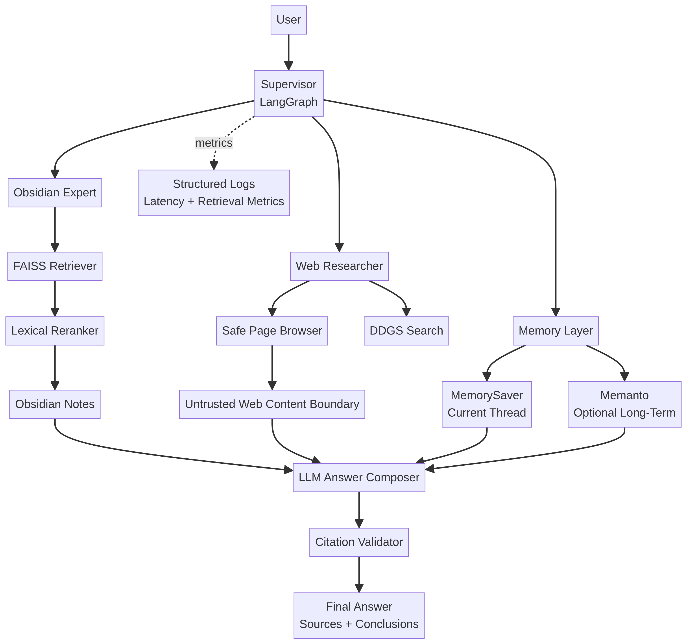

# Local Obsidian Multi-Agent RAG

[](https://github.com/ivan8597/obsidian-multi-agent/actions/workflows/tests.yml) [](https://www.python.org/) [](LICENSE)

Локальный исследовательский агент объединяет личные заметки Obsidian и публичный веб-поиск. Supervisor на LangGraph выбирает между двумя специалистами: `obsidian_expert` и `web_researcher`. Ответы выдаются потоково, а источники должны быть явно указаны.

Проект рассчитан на локальный запуск с [Ollama](https://ollama.com/), поэтому содержимое Obsidian и запросы к локальной модели могут оставаться на компьютере пользователя. Веб-агент обращается только к публичным HTTP(S)-страницам, если вы явно разрешаете ему исследовать интернет.

## Возможности

| Возможность | Реализация |
|---|---|
| Поиск по Obsidian | Markdown/TXT → чанки → FAISS → семантический поиск |
| Веб-исследование | DDGS-поиск и безопасное чтение текстовых HTTP(S)-страниц |
| Маршрутизация | Supervisor на LangGraph выбирает локального или веб-агента |
| Ответы | Streaming в CLI и Gradio |
| Источники | `[OBSIDIAN-N]` для локальных фрагментов и URL для веб-источников |
| Обновление базы | Watchdog автоматически пересобирает индекс после изменения заметок |
| Память диалога | `MemorySaver` для текущего `thread_id` |
| Долговременная память | Необязательная интеграция с Memanto |

## Архитектура

```text
Запрос пользователя
        ↓
Supervisor
   ┌────┴────┐
   ↓         ↓
Obsidian   Web Researcher
   │         │
FAISS     DDGS + browse_page
   └────┬────┘
        ↓
Ответ с разделением источников и выводов
```

FAISS отвечает на вопрос «что содержится в заметках», LangGraph хранит состояние текущего диалога, а Memanto может использоваться как отдельный слой долговременной памяти для фактов, предпочтений, решений и знаний между сессиями.

## Требования

Для базового локального запуска нужны:

- Python 3.11 или 3.12;
- [Ollama](https://ollama.com/);
- модель чата и embedding-модель Ollama;
- локальная папка Obsidian с файлами `.md` или `.txt`;
- примерно 4–8 ГБ свободной оперативной памяти в зависимости от выбранной модели.

Установите модели:

```bash
ollama pull llama3.2
ollama pull nomic-embed-text
```

Если Ollama работает не на стандартном адресе, измените `OLLAMA_BASE_URL` в `.env`.

## Установка

### Linux и macOS

```bash
git clone https://github.com/ivan8597/obsidian-multi-agent.git
cd obsidian-multi-agent

python3 -m venv .venv
source .venv/bin/activate
python -m pip install --upgrade pip
python -m pip install -e ".[dev]"
```

### Windows PowerShell

```powershell
git clone https://github.com/ivan8597/obsidian-multi-agent.git
cd obsidian-multi-agent

py -3.12 -m venv .venv
.venv\Scripts\Activate.ps1
python -m pip install --upgrade pip
python -m pip install -e ".[dev]"
```

Создайте файл настроек:

```bash
cp .env.example .env
```

В Windows можно скопировать `.env.example` вручную и переименовать его в `.env`.

Минимальная настройка:

```env
OBSIDIAN_VAULT_PATH=/absolute/path/to/your/Obsidian/Vault
OLLAMA_BASE_URL=http://127.0.0.1:11434
OLLAMA_CHAT_MODEL=llama3.2
OLLAMA_EMBED_MODEL=nomic-embed-text
WATCH_OBSIDIAN=true
```

Для Windows используйте, например, `OBSIDIAN_VAULT_PATH=C:/Users/you/Documents/MyVault`.

## Запуск через Gradio

Основной интерфейс проекта — локальное Gradio-приложение:

```bash
python -m src.gradio_app
```

Откройте в браузере:

```text
http://127.0.0.1:7860
```

Можно изменить адрес и порт:

```bash
python -m src.gradio_app --host 127.0.0.1 --port 7860
```

Интерфейс содержит чат с потоковой выдачей, поле `ID сессии`, панель источников, diagnostics-панель, индикатор количества индексированных фрагментов и кнопку `Переиндексировать Obsidian`. Diagnostics показывает `run_id`, предварительный route, причину выбора, число tool calls, найденные citations, web URLs, latency и stop reason. Если `WATCH_OBSIDIAN=true`, изменения заметок автоматически запускают консервативную пересборку индекса.

По умолчанию Gradio слушает только `127.0.0.1`, то есть интерфейс доступен лишь на этом компьютере. Не используйте `--host 0.0.0.0`, если не хотите открыть интерфейс другим устройствам в локальной сети.

### Запуск без Watchdog

Для больших vault или отладки можно отключить автоматическое наблюдение:

```bash
python -m src.gradio_app --no-watch
```

### Запуск CLI

Графический интерфейс не обязателен. Агент можно запустить из терминала:

```bash
python -m src.main
```

Доступны команды:

```text
/help      показать команды
/reindex   принудительно пересобрать FAISS-индекс
/sources   показать правила источников
/exit      завершить работу
```

## Примеры использования

Подробные сценарии находятся в [`examples/USAGE.md`](examples/USAGE.md). Несколько основных запросов:

| Запрос | Ожидаемая маршрутизация |
|---|---|
| «Что я записал о проекте Atlas?» | `obsidian_expert` |
| «Какие решения по архитектуре упомянуты в заметках?» | `obsidian_expert` |
| «Проверь актуальную документацию LangGraph» | `web_researcher` |
| «Сравни мои заметки о RAG с текущей документацией» | оба агента |
| «Какие идеи из моих заметок устарели?» | Obsidian + web researcher |

Агент должен разделять ответ на факты из заметок, внешние факты и собственные выводы. Для локальных фрагментов используются маркеры вида `[OBSIDIAN-1]`, а для внешних сведений — URL.

## Memanto: долговременная память

Memanto используется как **опциональный слой долговременной памяти**, а не как замена индексу Obsidian. FAISS ищет исходный текст заметок, а Memanto может хранить устойчивые факты, предпочтения, решения, ошибки и знания между отдельными сессиями.

Для включения:

```env
MEMANTO_ENABLED=true
MEMANTO_AGENT_ID=local-obsidian-researcher
MOORCHEH_API_KEY=your_key_or_local_backend_config
```

Перед этим настройте Memanto в локальном on-prem режиме согласно [официальному репозиторию Memanto](https://github.com/moorcheh-ai/memanto). Для базовой работы текущего проекта Memanto не требуется; при проблемах оставьте `MEMANTO_ENABLED=false`.

| Слой | Назначение |
|---|---|
| FAISS | Семантический поиск по файлам Obsidian |
| LangGraph `MemorySaver` | Контекст текущего диалога |
| Memanto | Долговременные факты и память между сессиями |

## Переиндексация и диагностика

При первом запуске индекс создаётся в `data/faiss_obsidian`. Чтобы принудительно пересобрать его, нажмите кнопку в Gradio или выполните:

```text
/reindex
```

Если приложение сообщает, что vault не найден, проверьте `OBSIDIAN_VAULT_PATH`. Если Ollama не отвечает, проверьте:

```bash
ollama list
curl http://127.0.0.1:11434/api/tags
```

Если embedding-модель отсутствует, выполните:

```bash
ollama pull nomic-embed-text
```

## Тестирование

Локально запустите:

```bash
python -m pytest -q
```

Статическая проверка:

```bash
ruff check src tests
```

GitHub Actions автоматически устанавливает зависимости, выполняет компиляцию Python-модулей, запускает smoke-тесты и проверяет Ruff для каждого push и pull request в ветку `master`.

## Безопасность и ограничения

Веб-инструмент принимает только `http` и `https`, проверяет HTTP-ошибки и ограничивает размер извлечённого текста. Это не sandbox веб-страниц: не передавайте агенту секреты и не разрешайте ему автоматически выполнять команды из найденного контента.

Агент может ошибиться в маршрутизации или интерпретации источников. Для критических сведений проверяйте исходные заметки и URL вручную. Особенно внимательно относитесь к веб-страницам, динамическому контенту, неоднозначным заметкам и устаревшим записям.

## Структура проекта

```text
src/
├── agent.py         # Supervisor и два специализированных агента
├── citations.py     # проверка маркеров источников
├── config.py        # настройки и validation из .env
├── gradio_app.py    # локальный Gradio UI
├── indexer.py       # FAISS + manifest + incremental indexing
├── main.py          # CLI и streaming
├── memory.py        # необязательная Memanto-интеграция
├── observability.py # structured latency logs
├── reranker.py      # deterministic lexical reranking
├── security.py      # SSRF и untrusted-content boundary
├── tools.py         # Obsidian search, web search, page reader
└── tracing.py       # RunTrace, route explanation and execution budgets
evaluation/
├── dataset.json
├── evaluate.py
├── metrics.py
└── README.md
docs/
├── architecture.md
├── architecture.mmd
└── architecture.png
examples/
└── USAGE.md         # сценарии запросов и примеры кода
.github/workflows/
└── tests.yml        # автоматические тесты GitHub Actions
tests/
├── test_gradio.py
├── test_indexer_incremental.py
├── test_quality_components.py
├── test_security_and_evaluation.py
└── test_smoke.py
```

## Лицензия

Проект распространяется под лицензией MIT.

## Portfolio architecture

Актуальная схема с границами доверия и слоями памяти доступна в [`docs/architecture.md`](docs/architecture.md). Исходник диаграммы находится в [`docs/architecture.mmd`](docs/architecture.mmd).



## Explainability and run budgets

Каждый запуск получает `run_id` и типизированный `RunTrace`. Trace фиксирует пользовательский запрос, объяснимый preflight route, tool calls, tool results, graph nodes, citations, URLs, финальный статус и причину остановки. Предварительный route является объяснением для пользователя; окончательное решение Supervisor остаётся авторитетным.

Для защиты от runaway runs применяется `RunBudget` с ограничениями общего времени, числа tool calls и stream chunks. При превышении лимита система возвращает статус `stopped` и machine-readable `stop_reason`, а не делает вид, что успешно завершила задачу.

## Evaluation

Проект содержит детерминированный evaluation harness в [`evaluation/`](evaluation/). Он не подменяет полноценную human или LLM-оценку, но даёт воспроизводимую базовую линию для retrieval и маршрутизации.

```bash
python -m evaluation.evaluate --predictions evaluation/predictions.example.json
```

Измеряются Recall@k, Precision@k, MRR, citation correctness, keyword relevance и routing accuracy. Файл [`evaluation/dataset.json`](evaluation/dataset.json) нужно адаптировать под конкретный vault: демонстрационные вопросы и источники не являются результатами оценки реального хранилища.

## Quality and reproducibility

В репозитории зафиксированы [`uv.lock`](uv.lock), [`.python-version`](.python-version) и [MIT LICENSE](LICENSE). Для воспроизводимой установки можно использовать uv:

```bash
uv sync --locked --extra dev
uv run pytest -q
uv run ruff check src tests evaluation
```

GitHub Actions выполняет `uv lock --check`, компиляцию модулей, тесты, evaluation smoke check и Ruff на Python 3.11 и 3.12.

## Incremental indexing

Watchdog больше не обязан пересобирать весь FAISS-индекс после каждого изменения. Индексатор хранит manifest с hash файла и стабильными chunk ID. При изменении заметки удаляются только старые chunks этого файла, после чего embedding выполняется для новых chunks. Если incremental update невозможен из-за несовместимости локального индекса, применяется безопасный fallback на полную пересборку.

Для существующего индекса, созданного старой версией, рекомендуется один раз выполнить:

```text
/reindex
```

## Citation validation and reranking

Перед выдачей в Gradio ответ проходит базовую проверку маркеров `[OBSIDIAN-N]`. Неизвестные ссылки помечаются предупреждением, а не выдаются как подтверждённые. FAISS retrieval возвращает расширенный кандидатный набор, после чего применяется детерминированный lexical reranker и в финальный контекст передаётся top-k.

## Security hardening

Веб-браузер блокирует не только `file://` и `javascript:`, но и localhost, loopback, private networks, link-local и IPv6 ULA адреса. Это снижает риск SSRF, однако не заменяет сетевой sandbox или firewall.

Результаты поиска и содержимое веб-страниц оборачиваются в `UNTRUSTED_WEB_CONTENT`. System prompts явно запрещают выполнять команды из веб-текста, раскрывать секреты или содержимое локального vault по просьбе веб-страницы. Это защита от prompt injection на уровне приложения; критические deployment-сценарии всё равно должны использовать изоляцию сети.

## Observability

События `agent_request`, `retrieval`, `web_search` и `web_browse` записываются как JSON-сообщения с latency и основными полями. Это создаёт основу для анализа `request_latency`, `retrieval_latency`, количества найденных chunks и времени веб-поиска без добавления внешней инфраструктуры.

## Ограничения и roadmap

P0 и основные P1-задачи покрыты кодом и тестами. Docker, Prometheus, Grafana, PostgreSQL memory, authentication, multi-user режим и production deployment остаются отдельным P2-этапом. Они требуют решений о модели угроз, хранении данных, секретах и целевой среде развёртывания.
