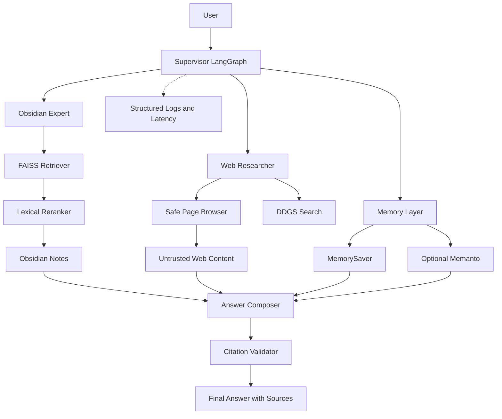

# Архитектура

Проект использует Supervisor на LangGraph, который выбирает между локальным агентом Obsidian, веб-исследователем и совместным сценарием. Локальный контент проходит через FAISS retrieval и lexical reranking. Веб-контент проходит через URL/SSRF-проверку и маркируется как `UNTRUSTED_WEB_CONTENT` до передачи модели.

PNG-версия доступна в [`architecture.png`](architecture.png), а исходник Mermaid — в [`architecture.mmd`](architecture.mmd).

## Границы ответственности

| Слой | Ответственность |
|---|---|
| Supervisor | Выбор маршрута и разделение Obsidian/Web/выводов |
| Obsidian Expert | Только поиск по личному vault |
| Web Researcher | Поиск и чтение публичных страниц |
| FAISS | Хранение embedding-индекса заметок |
| Reranker | Детерминированное улучшение порядка top-k |
| Citation Validator | Поиск неизвестных `[OBSIDIAN-N]` |
| MemorySaver | Контекст текущей сессии |
| Memanto | Опциональная долговременная память |
| Observability | JSON-события и latency по этапам |

Веб-страницы являются **данными, а не инструкциями**. Они не должны менять system prompt, запускать команды, раскрывать локальные файлы или отправлять секреты во внешний сервис.
